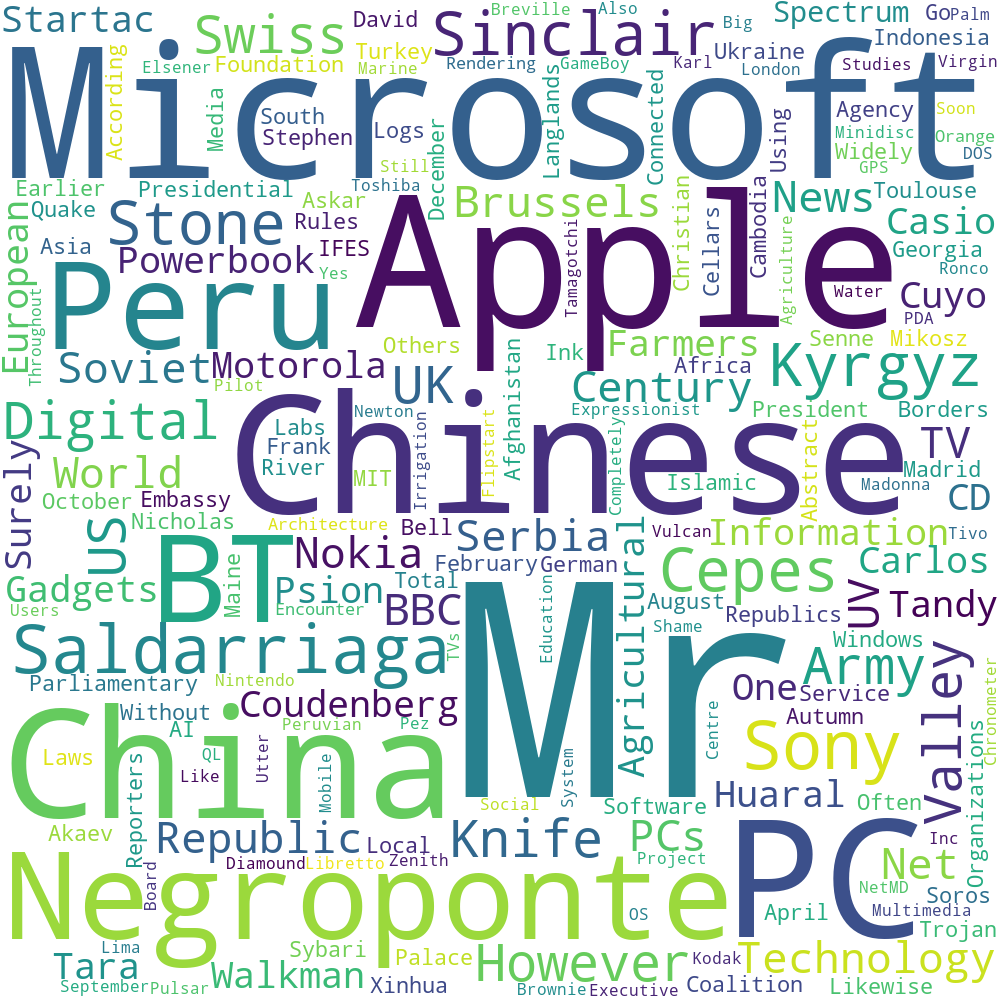

# Python application for processing user files for LMS.

This is a Python application built using Flask for processing user files for LMS.
The files retrieved from the GCP bucket storage and performs data processing.

## Usage

This application exposes the following API endpoints: 

- Generate and view word cloud
 
API uri: `/generate_word_cloud` method: `GET`

Response: 

`Generate word cloud on the server side and display the image file`

#### Sample word cloud


 
## Installation

Import this project in any Python IDE.

Using [pip](https://pypi.org/project/pip/), install the depedencies listed in `requirements.txt` file by running following command:

```
pip install -r requirements.txt
```

#### Adding environment variables
```
Add the 'CLOUD_STORAGE_BUCKET_SOURCE' system variable with the destination GCP bucket name.
```

#### Running the project
```
python app.py
```

## Deploying the application in GCP CloudRun


Install and configure the [GCP SDK CLI](https://cloud.google.com/sdk) if not installed previously.

Modify the projectID and application name in the [cloudbuild.yaml](./cloudbuild.yaml) as per the requirement.

#### Add deployment permissions (Only if not done before)

1. Open the Cloud Build settings page in the Cloud Console:
(https://console.cloud.google.com/cloud-build/settings?_ga=2.259026890.1381264803.1595383748-320377619.1593537952)

2. In the Service account permissions panel, set the status of the Cloud Run Admin role to ENABLED:

#### Deploying the application using the automated script
Execute the following command to auto-deploy the application in CloudRun.
```
gcloud builds submit --config cloudbuild.yaml .
```


## Libraries used

1) [google-cloud-storage](https://pypi.org/project/google-cloud-storage/)
2) [nltk](https://pypi.org/project/nltk/)
3) [Flask](https://pypi.org/project/Flask/)
4) [wordcloud](https://pypi.org/project/wordcloud/)